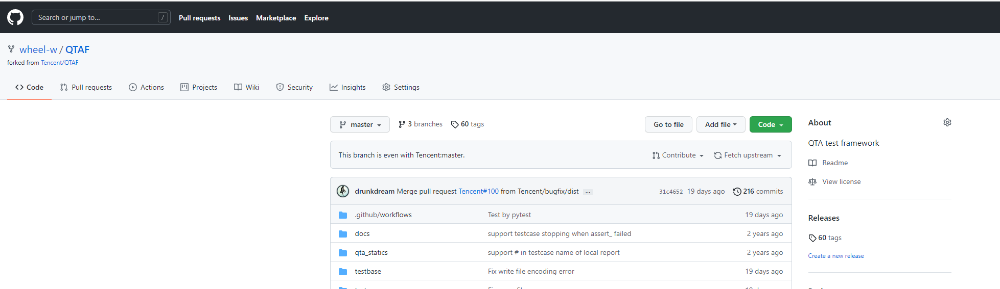
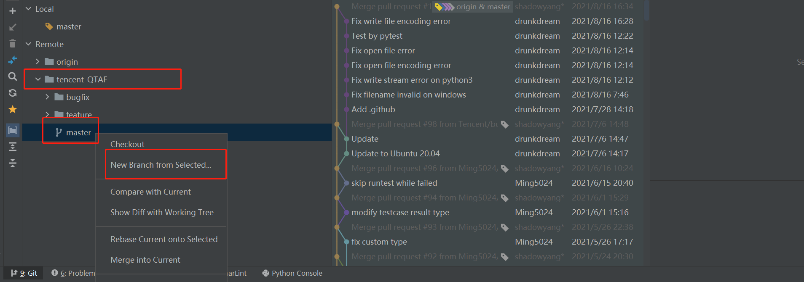
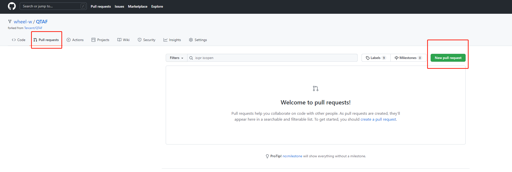
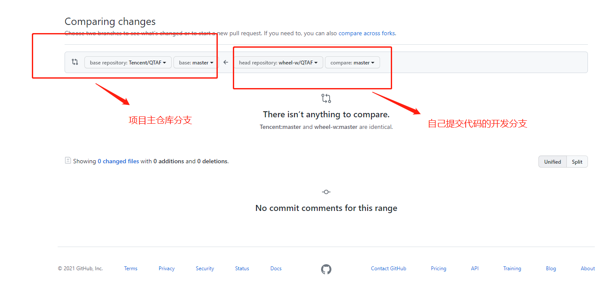

# 一、快速开始

## 1. 从主仓库fork代码到自己的个人仓库


​		项目主仓库将开源项目代码 fork 到个人仓库，完成后就可以在个人项目下查看该开源项目代码了




## 2. git clone 自己仓库的代码到本地

1.  在自己电脑新建一个空目录（PS：本地开发路径中请不要包含中文）
2. cd 进入新建的空目录,进行git clone

```
# 克隆自己git仓库代码到本地
https://github.com/wheel-w/QTAF.git
# 添加自己fork的主仓库源
git remote add tencent-QTAF https://github.com/Tencent/QTAF.git
git pull tencent-QTAF
```

## 3. 本地运行项目

1. 在C:\Windows\System32\drivers\etc下的host文件中添加

   ```
   127.0.0.1 dev.paas-edu.bktencent.com
   ```

2. 本地创建数据库

   ```
   CREATE DATABASE `xxx` DEFAULT CHARACTER SET utf8 COLLATE utf8_general_ci;
   ```

3. 将`config/dev.py`复制到项目根目录下，并且重命名为`local_settings.py`，然后在`local_settings.py`添加数据库配置

   ````
   DATABASES = {
       "default": {
           "ENGINE": "django.db.backends.mysql",
           "NAME": APP_CODE,  # noqa
           "USER": "", # 自己的mysql用户名
           "PASSWORD": "",# 自己的mysql密码
           "HOST": "localhost",
           "PORT": "3306",
       },
   }
   ````

   PS：`local_settings.py`是自己的本地开发环境配置，不需要提交到git上

4. 运行

   ```shell
   pip install -r requirements.txt
   python manage.py migrate
   python manage.py runserver dev.paas-edu.bktencent.com:8000
   ```

5. 浏览器打开http://dev.paas-edu.bktencent.com:8000，测试get请求和post请求是否发送成功
   

6. 本地运行bkui，检测跨域配置

   ```
   # 进入前端工作目录
   cd frontend
   # 下载依赖
   npm i
   # 运行项目
   npm run dev
   ```

   浏览器访问[index (bktencent.com)](http://dev.paas-edu.bktencent.com:8080/)，点击发送get,post请求

   

   # 二、开发须知

   ## 1. 开发模式----基于PR的开发模式

   

   1. 开发前，首先git pull 项目主仓库下拉最新代码

   2. 然后基于自己要开发的分支新建分支进行开发
      

   3. 开发完成后,提交代码到自己的个人仓库

      ```
      git add .
      git commit -m 提交信息
      git push origin
      ```

   4. 打开自己的github,提PR
      
      

   5. 提交pr之后，主仓库负责人进行提交代码的review，通过则合入开发分支

   6. 没有通过，开发者则根据review的修改意见修改完善代码

## 2. 开发规范

- 前端规范------[文档中心 | 蓝鲸 (tencent.com)](https://bk.tencent.com/docs/document/6.0/130/5882)

- 后端规范------[文档中心 | 蓝鲸 (tencent.com)](https://bk.tencent.com/docs/document/6.0/130/5872)

- 代码提交规范

  - 在根目录新建`.gitignore`，忽略掉不需要提交的文件

    ```
    .gitignore
    __pycache__
    .idea
    node_modules
    local_settings.py
    ```

  - 配置`pre-commit`

    `pre-commit`在git add提交之后，然后执行git commit时执行，如果脚步执行没有报错就继续提交，否则就驳回提交的操作，从而实现对代码的检查、优化代码格式等任务。

    ```
    # 安装pre-commit
    pip install pre-commit
    
    # 安装git hook脚本,成功之后会在.git/hooks里生成pre-commit文件
    pre-commit install
    
    # 运行所配置的所有规则，使其起作用
    pre-commit run --all-files
    
    ```

  - commit分类-----每次代码提交必须有备注说明，注明本次提交做了哪些修改
    `bugfix` - 线上功能 bug
    `sprintfix` - 未上线代码修改 （功能模块未上线部分 bug）
    `minor` - 不重要的修改（换行，拼写错误等）
    `feature` - 新功能说明

    ```git
    # 新增功能提交代码则
    git add .
    git commit -m feature:xxxx
    
    # 修复线上功能的bug则
    git add .
    git commit -m bugfix:xxxxxxxxxxxxx
    ```


# 三、学习资料

1. 在线课程[【蓝鲸开课】2020秋季蓝鲸基础开发实战课程-学习视频教程-腾讯课堂 (qq.com)](https://ke.qq.com/course/3030664?taid=10315536490446472)

2. 文档中心[文档中心 | 蓝鲸 (tencent.com)](https://bk.tencent.com/docs/document/6.0/130/5948)

3. `django-rest-framework`[Home - Django REST framework (django-rest-framework.org)](https://www.django-rest-framework.org/)

4. `django 2.2`[Django 文档 | Django 文档 | Django (djangoproject.com)](https://docs.djangoproject.com/zh-hans/2.2/)

5. 前端组件库[蓝鲸 MagicBox-Vue 组件库 (tencent.com)](https://magicbox.bk.tencent.com/static_api/v3/components_vue/2.0/example/index.html#/)

6. vue语法[介绍 — Vue.js (vuejs.org)](https://cn.vuejs.org/v2/guide/)

   

