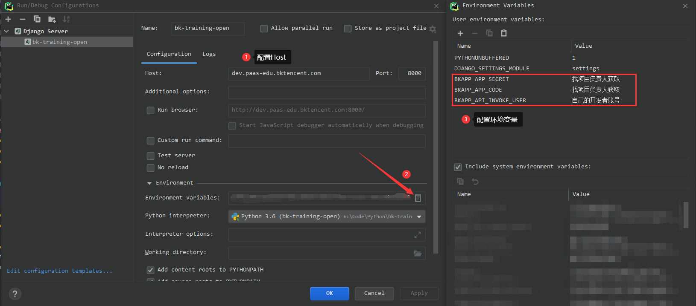

<!-- TOC -->

- [一、快速开始](#一快速开始)
  - [1. 从主仓库fork代码到自己的个人仓库](#1-从主仓库fork代码到自己的个人仓库)
  - [2. git clone 自己仓库的代码到本地](#2-git-clone-自己仓库的代码到本地)
  - [3. 本地运行项目](#3-本地运行项目)
- [二、预期功能](#二预期功能)
  - [1. 每日小结](#1-每日小结)
  - [2. 我的组](#2-我的组)
  - [3. 每日小结查看](#3-每日小结查看)
  - [4. 定时任务](#4-定时任务)
- [三、开发须知](#三开发须知)
  - [1. 开发模式----基于PR的开发模式](#1-开发模式----基于pr的开发模式)
  - [2. 开发流程](#2-开发流程)
  - [3. 开发规范](#3-开发规范)
  - [4. 装饰器的使用](#4-装饰器的使用)
- [四、学习资料](#四学习资料)

<!-- /TOC -->
# 一、快速开始

## 1. 从主仓库fork代码到自己的个人仓库


项目主仓库将开源项目代码 fork 到个人仓库，完成后就可以在个人项目下查看该开源项目代码了


## 2. git clone 自己仓库的代码到本地

1.  在自己电脑新建一个空目录（PS：本地开发路径中请不要包含中文）
2. cd 进入新建的空目录,进行git clone

```
# 克隆自己git仓库代码到本地
git clone https://github.com/wheel-w/bk-training-open.git
# 添加自己fork的主仓库源
git remote add blueking-train https://github.com/TencentBlueKing/bk-training-open.git
git pull blueking-train
```

## 3. 本地运行项目

1. 在C:\Windows\System32\drivers\etc下的host文件中添加
   ```
   127.0.0.1 dev.paas-edu.bktencent.com
   ```

2. 本地创建数据库

   ```
   CREATE DATABASE `bk-training-open` DEFAULT CHARACTER SET utf8 COLLATE utf8_general_ci;
   ```

3. 在项目根目录下创建`local_settings.py`，然后在`local_settings.py`添加数据库配置

   ```python
   from config import APP_CODE
   
   DATABASES = {
       "default": {
           "ENGINE": "django.db.backends.mysql",
           "NAME": APP_CODE,
           "USER": "", #数据库用户名
           "PASSWORD": "", #数据库密码
           "HOST": "localhost",
           "PORT": "3306",
       },
   }
   ```

   PS：`local_settings.py`是自己的本地开发环境配置，不需要提交到git上

4. 配置环境变量

   ```
   # 自己的用户名（蓝鲸开发者账号）
   BKAPP_API_INVOKE_USER=xxxxxxxxxxxxx
   # 网站完整网址
   BKAPP_SITE_URL=http://dev.paas-edu.bktencent.com:8080/
   # 蓝鲸SaaS平台url
   BKAPP_PAAS_URL=https://paas-edu.bktencent.com
   
   # 以下环境变量需找负责人获取
   # 项目 APP_CODE & APP_SECRET
   BKAPP_APP_CODE=xxxxxxxxxxxxx
   BKAPP_APP_SECRET=xxxxxxxxxxxxx
   # 权限中心的token
   BKAPP_IAM_AUTH_TOKEN=xxxxxxxxxxxxx
   # 权限中心的网址
   BKAPP_IAM_HOST=xxxxxxxxxxxxx	# 该域名需要同时配置本地hosts解析
   # 权限中心拉取资源的系统id
   BKAPP_IAM_SYSTEM_ID=xxxxxxxxxxxxx
   ```

   + 在PyCharm中配置环境变量以及主机名

   

   + 配置Terminal和Python Console的环境变量

     只配置Django Server的环境变量的话，无法直接在Terminal中执行migrate命令，需要在执行前手动设置相关的环境变量

     ```shell
     CMD:
     set BKAPP_APP_CODE=xxxx
     
     PowerShell:
     $env:BKAPP_APP_CODE="xxx"
     
     macOS:
     export BKAPP_APP_CODE=xxxx
     ```

5. 运行

   ```shell
   pip install -r requirements.txt
   python manage.py migrate
   python manage.py runserver dev.paas-edu.bktencent.com:8000
   ```

6. 浏览器打开http://dev.paas-edu.bktencent.com:8000 测试get请求和post请求是否发送成功
   

7. 本地运行bkui，检测跨域配置

   ```
   # 进入前端工作目录
   cd frontend
   # 下载依赖
   npm i
   # 运行项目
   npm run dev
   ```

   浏览器访问[index (bktencent.com)](http://dev.paas-edu.bktencent.com:8080/) 点击发送get,post请求

   

# 二、预期功能

## 1. 每日小结

   1. 根据用户所在组获取日报模板，如果没有日报模板，则使用提供的两个默认日报模板（模板1：今日总结 明日计划 感想 ；模板2： 今日总结 明日计划）
   2. 用户点击保存日报进行日报保存
      <1> 如果日期为当前日期，点击保存日报，日报保存到数据库，日报状态变为已保存
      <2> 如果日期为之前的日期，点击保存日报，用户可选择仅保存或者保存并且发送邮件通知

   

## 2. 我的组

   1. 新建组,点击弹窗
      
   2. 编辑基本信息，修改组的管理员和名称
   3. 创建日报模板，使用输入框，多个内容以“,”分隔,
      例如创建模板---今日总结 明日计划 感想 ，则在输入框输入(今日总结,明日计划,感想）
      
   4. 添加成员
      

## 3. 每日小结查看

   1. 显示用户所在的组，点击对应组展开对应的成员列表
   2. 点击组旁边的日期按钮，切换到日报维度为日期，点击对应日期，显示某一天组内所有成员的工作总结

   

## 4. 定时任务

   1. 邮件模板编写
   2. 每天早上10点向组内成员发邮件推送前一天的工作总结和今日计划
   3. 每天晚上8点邮件提醒用户进行今天的总结

# 三、开发须知

## 1. 开发模式----基于PR的开发模式

   

   1. 开发前，首先git pull 项目主仓库下拉最新代码

      ```
      git pull blueking-train
      ```

   2. 然后基于自己要开发的分支新建分支进行开发
      

   3. 开发完成后,提交代码到自己的个人仓库

      ```
      git add .
      git commit -m 提交信息
      git push origin
      ```

   4. 打开自己的github,提PR(Pull requests)
      
      

   5. 提交pr之后，主仓库负责人进行提交代码的review，通过则合入开发分支

   6. 没有通过，开发者则根据review的修改意见修改完善代码

## 2. 开发流程


## 3. 开发规范

- 前端规范------[文档中心 | 蓝鲸 (tencent.com)](https://bk.tencent.com/docs/document/6.0/130/5882)

- 后端规范------[文档中心 | 蓝鲸 (tencent.com)](https://bk.tencent.com/docs/document/6.0/130/5872)

- 代码提交规范

  - 在根目录新建`.gitignore`，忽略掉不需要提交的文件

    ```
    .gitignore
    __pycache__
    .idea
    node_modules
    local_settings.py
    ```

  - 配置`pre-commit`

    `pre-commit`在git add提交之后，然后执行git commit时执行，如果脚步执行没有报错就继续提交，否则就驳回提交的操作，从而实现对代码的检查、优化代码格式等任务。

    ```
    # 安装pre-commit
    pip install pre-commit
    
    # 安装git hook脚本,成功之后会在.git/hooks里生成pre-commit文件
    pre-commit install
    
    # 运行所配置的所有规则，使其起作用
    pre-commit run --all-files
    
    ```

  - commit分类-----每次代码提交必须有备注说明，注明本次提交做了哪些修改

    `bugfix` - 线上功能 bug
    
    `sprintfix` - 未上线代码修改 （功能模块未上线部分 bug）
    
    `minor` - 不重要的修改（换行，拼写错误等）
    
    `feature` - 新功能说明

    ```git
    # 新增功能提交代码则
    git add .
    git commit -m feature:xxxx
    
    # 修复线上功能的bug则
    git add .
    git commit -m bugfix:xxxxxxxxxxxxx
    ```
  
## 4. 装饰器的使用

- 限制请求方法

  限制请求方法请直接使用Django自带的装饰器，有`require_http_methods`, `require_GET`, `require_POST`三种，导入方式如下：

  ```python
  from django.views.decorators.http import require_http_methods, require_GET, require_POST
  ```

  `require_GET`限制只能用GET方法，`require_POST`限制只能用POST方法，而`require_http_methods`则以数组作为参数限制指定的几种方法，用法示例如下：

  ```python
  @require_http_methods(["POST", "PATCH"])
  ```

- 组权限限制

  封装了鉴别当前用户是否为指定组成员或管理员的装饰器[is_group_member](./home_application/utils/decorator.py)

  - 为了避免`request.body`无法重复读取的问题，使用时需要将组id放在URL中
  - 其中装饰器的参数`admin_needed`用来限制需要管理员才能访问的方法，默认为None，表示该请求下所有方法都不需要管理员权限，当指定方法需要管理员权限时需要将对应的方法以`list`的形式传进去
  
  `urls.py`中的写法参考如下：
  
  ```python
  path("report_template/<int:group_id>/", views.report_template),
  ```
  
  >  **实际使用的时候url中一定不要漏掉组id**
  
  `views.py`中的使用方法参考如下：
  
  ```python
  from home_application.utils.decorator import is_group_admin
  
  @is_group_member(admin_needed=["POST", "PATCH", "DELETE"])
  def report_template(request, group_id):
      # 相关操作
  ```
  
## 5. 邮件模板

1. `simple_notify.html`

   发送简单的通知，需要的参数为：

   + notify_title          通知标题
   + notify_content   通知正文
   + link_text             超链接显示的文本
   + link_url               超链接网址
   
   以上两个参数都支持添加html标签，下边的例子就是在邮件正文中添加了超链接
   
   ```python
   mail_content = get_template("simple_notify.html").render(
       {
           "notify_title": "日报提醒",
           "notify_content": "notify_content",
           "link_text": "link_text",
           "link_url": "link_url"
       }
   )
   send_mail(receiver__username=username, title="日报提醒助手", content=mail_content, body_format="Html")
   ```

# 四、学习资料

1. 在线课程[【蓝鲸开课】2020秋季蓝鲸基础开发实战课程-学习视频教程-腾讯课堂 (qq.com)](https://ke.qq.com/course/3030664?taid=10315536490446472)

2. 文档中心[文档中心 | 蓝鲸 (tencent.com)](https://bk.tencent.com/docs/document/6.0/130/5948)

3. `django-rest-framework`[Home - Django REST framework (django-rest-framework.org)](https://www.django-rest-framework.org/)

4. `django 2.2`[Django 文档 | Django 文档 | Django (djangoproject.com)](https://docs.djangoproject.com/zh-hans/2.2/)

5. 前端组件库[蓝鲸 MagicBox-Vue 组件库 (tencent.com)](https://magicbox.bk.tencent.com/static_api/v3/components_vue/2.0/example/index.html#/)

6. vue语法[介绍 — Vue.js (vuejs.org)](https://cn.vuejs.org/v2/guide/)

